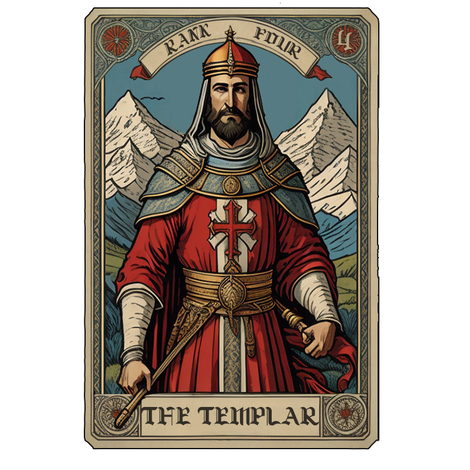
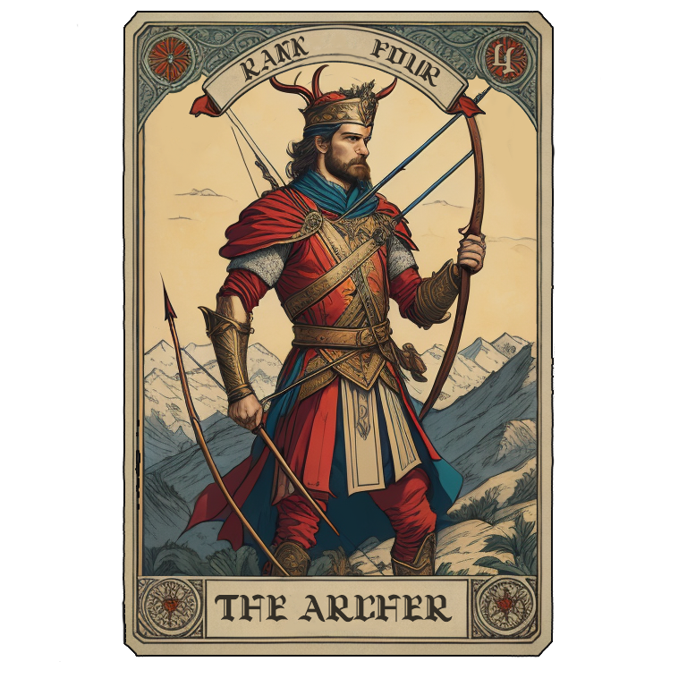
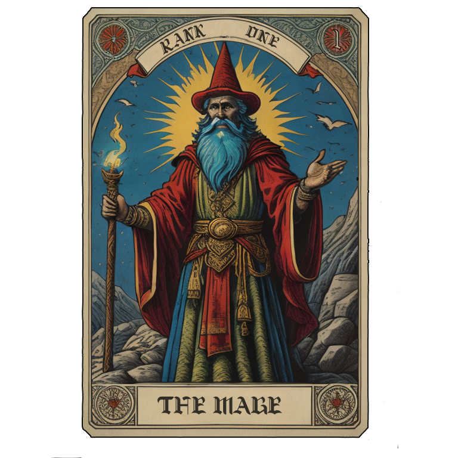
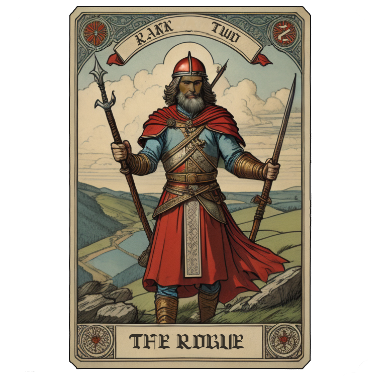

# M.A.S.T.R. Tactics

## A two-player websockets fantasy-themed game expanding on the classic Rock-Paper-Scissors.

Are you ready for a battle of epic proportions? 

Introducing M.A.S.T.R. Tactics (Mage-Archer-Sorcerer-Templar-Rogue), an uproarious two-player expanded rock-paper-scissors game! 

Each player chooses one of the five characters—Mage, Archer, Rogue, Sorcerer, or Templar—and strategically attempt to outwit their opponent. 

*  ***Magicians*** use mysticism to turn spells into powerful attacks

*  ***Archers*** find cunning and deadly accurate with bows and arrows

*  ***Sorcerers*** harness the power of nature to overcome obstacles 

*  ***Templars*** use the devine power of the gods to deliver justice

*  ***Rogues*** rely on agility to swiftly crush any opposition

Will you select your champion wisely, or will you be vanquished? Join the battle now and see whose mettle will prevail!

## RULES

The character *deck* is randomized and a *hand* of 5 cards are dealt to both players.

Each player chooses a **3-card battle-party** from their *hand* of five-random cards drawn from a common character *deck*, and places them face down, in opposition to the party selected by your opponent.

Both players reveal their choices by revealing their *battle party*, placing their chosen champions into the battlefield.. the BATLLE BEGINS!  A *battle* is a set of three face-to-face *skirmishes*.

Every *faction* is vulnerable to attack from its nemisis faction as shown:

*  ***Magicians*** are defeated by *rogues* and *sorcerors*.

*  ***Archers*** are defeated by *templars* and *magicians*.

*  ***Sorcerers*** are defeated by *archers* and *rogues*.

*  ***Templars*** are defeated by *sorcerors* and *magicians*.

*  ***Rogues*** are defeated by *templars* and *archers*.

If two members of the same *faction* clash during battle, the higher *class* is the victor.

Each player collects one (1) point for each victorious skirmish in the battle. 

Three (3) points are awarded per **battle**, or, one (1) per **skirmish**.

Two (2) bonus beefy-brawler points are awarded to the player with the battle party of higher rank (the sum of all *rank* values) in their battle party.

All revealed cards then move to the communal discard pile, and each player draws into their hand, back up to five character cards, from the communal deck to prepare for the next battle.

If the deck runs out of character cards, the discard pile is randomized and becomes a new communal deck.

The games ends when a player reaches 25 points at the end of a battle.

Example round:

# An Example Battle

### Each player chooses their battle party and places them in the center of the battlfield (play area):

| Player | Skirmish One | Skirmish Two | Skirmish Three |
| :----: | :----: | :----: | :----: |
| Opponent |  |  |  |
| You |  |  |  |

### This cock-eyed but noble Templar finds himself in a skirmish with a novice Mage, just out of the academy:

### However, Mages are first taught how to quickly dispatch a simple Templar, no matter his might.  The first skirmish point goes to you!

### Now, the second skirmish of the battle.  In this case, two Archers are fighting to the death:  

### Before the lesser experienced Archer knows what hit him, his veteran opponent has already taken deadly action.  One skirmish point to your opponent.  :-(

### Finally, at the crucial crest of battle, one of your opponents Mages tries his tricks on your Rogue, but suffers instead a dastardly doom (pocket sand!).. another skirmish point for you!

| Player | Skirmish One | Skirmish Two | Skirmish Three | Total |
| :----: | :----: | :----: | :----: | :---: |
| Opponent | 0 | 1| 0 | **1** |
| You | 1 | 0 | 1 | **2** |

### You have won the battle, earning 2 points to your game total.

### Now each player draws back up to five cards, and a new battle is planned.  

## Play continues, grueling battle after grueling battle, until the ***FIRST PLAYER reaching 25 points WINS THE WAR*** to become a MASTR Tactician!
